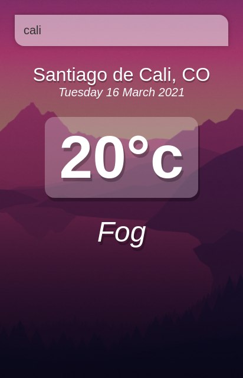

# weather vue app

## Screenshot

## Project setup

~~~sh
npm install
~~~

### Compiles and hot-reloads for development

~~~sh
npm run serve
~~~

### Compiles and minifies for production

~~~sh
npm run build
~~~

### Lints and fixes files

~~~sh
npm run lint
~~~

## Credits

YT: [Tyler Potts](https://www.youtube.com/channel/UCBBGM84ZOs7z5jpTQAaZ_Hg) | Github: [TylerPottsDev](https://github.com/TylerPottsDev)
